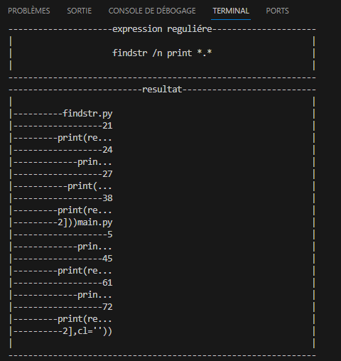
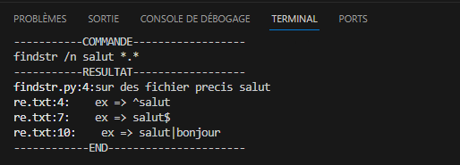

# py-Regex-T 


<!--  -->

__py-Regex-T__ se présente comme un programme sophistiqué développé en __Python__, spécifiquement élaboré pour la recherche approfondie de données au sein de fichiers. Grâce à l'utilisation judicieuse des __expressions régulières__, ce programme offre une approche puissante et flexible pour l'analyse et l'extraction ciblée d'informations à partir de divers types de __fichiers__.

# Test


# <b style="text-transform:capitalize">dependence</b>

+ pytesseract
+ Pillow

# Utilisation 

```bash
pip install pytesseract Pillow
git clone https://github.com/Tostenn/py-Regex-T.git
cd py-Regex-T
python main.py
```

## utiliser FINDSTR


Vous avez la possibilité d'utiliser également l'outil classique __findstr__ de win32. J'ai effectué des optimisations pour améliorer l'affichage des données lors de l'utilisation de cette commande.

```bash
python findstr.py
```


ou une approche plus classique 

```bash
py-Regex-T.bat
```
